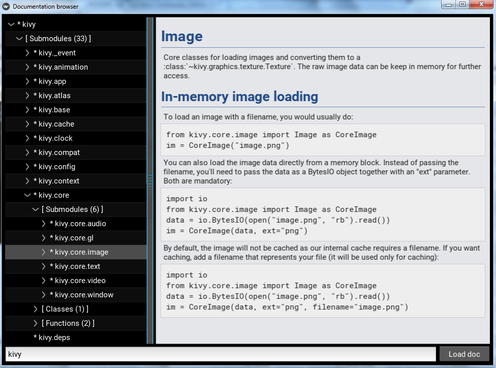

# DocBrowser
Kivy (http://kivy.org) extensions

Browser for view documentation of Python modules

Features
========

This widget shows you docstrings of specified Python module\package.
The widget is useful for monitoring the availability of documentation in the
code.

It has an object inspector which shows all the members in hierarchy:

  

Possible categories of object inspector:

* [ Submodules ] - list of avilable submodules
* [ Classes ] - list of avilable classes
* [ Functions ] - list of the module's routines
* [ Imported ] - list of imported modules

You can enable\disable the display of certain categories by changing the
appropriate properties (see the module documentation).

NOTE:

    Please note that the module you want to see must be installed in the
    currently active virtual environment

Possible 2 ways of usage:

* as a Kivy widget:

        if __name__ == '__main__':
            from kivy.app import runTouchApp
            from docbrowser import DocBrowser
            runTouchApp(DocBrowser(module_name=__name__))

* as a stand-alone app:

        from docbrowser import DocBrowserApp
        DocBrowserApp(module_name=__name__).run()
        
Also app can be started via shell (the module name is specified as a parameter):

    python docbrowser.py kivy.core
    
NOTE:

    Please note that if you've changed docstrings you need to restart app to
    see the changes.
    
    
Installation & Requirements
===========================

0. Python 2.7 (or higher) or Python 3.4 (or higher)

1. Install `Kivy` library 1.9.1 or higher (https://kivy.org/#download)

2. Install `Kivy Garden` (if not already installed):

        pip install kivy-garden

3. Install `XPopup` extension 0.2.2 or higher
   (https://github.com/kivy-garden/garden.xpopup):
    
        garden install xpopup
    
4. Download and unpack `DocBrowser`

5. Ready for use.

Version history
===============
* 0.1
    
    Initial release